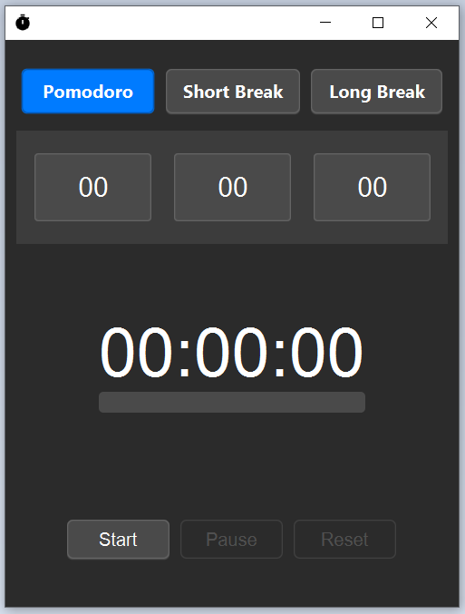

# Simple Timer App

> **Archived** — This project is no longer maintained and will be archived.
>
> Development has moved to a new Flutter rebuild: [Fahriza253/pomodoro-app](https://github.com/Fahriza253/pomodoro-app.git).

A lightweight, cross-platform desktop timer application built with JavaFX. This is a personal learning project for exploring Java desktop application development and Maven build workflows.



## Installation

Download the latest release and run `TimerApp.exe`.

### Build from Source

Clone this repo

```bash
git clone https://github.com/Fahriza253/simple-timer-app.git
```

#### Build Steps

Compile and create the optimized runtime

```bash
mvn clean compile javafx:jlink
```

Package the application as an executable:

```bash
jpackage --type app-image \
  --name TimerApp \
  --module com.dpzstudio.timer/com.dpzstudio.timer.App \
  --runtime-image target/TimerApp \
  --dest target/dist
```

## Usage

1. Launch the application
2. Set your desired timer duration
3. Click Start to begin
4. The app will notify you with a sound when the timer completes

## Credits

- **Sound Effect**: [bell ding 1.wav by 5ro4](https://freesound.org/s/611113/)
